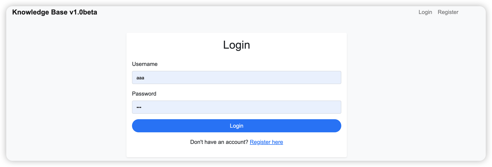
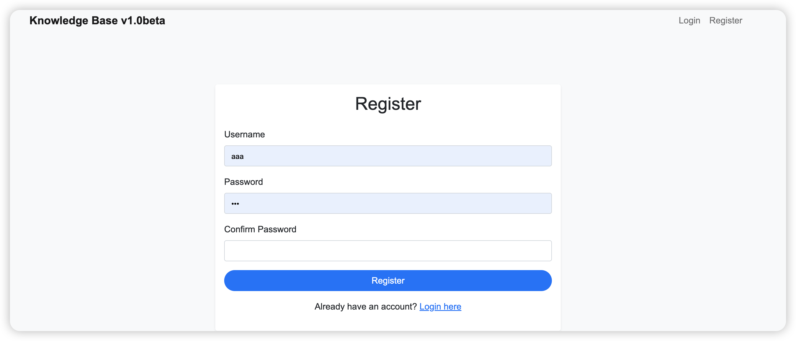
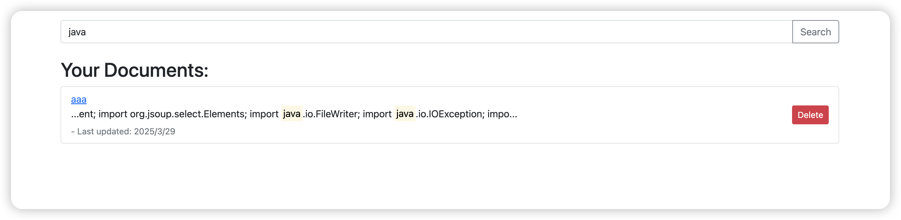
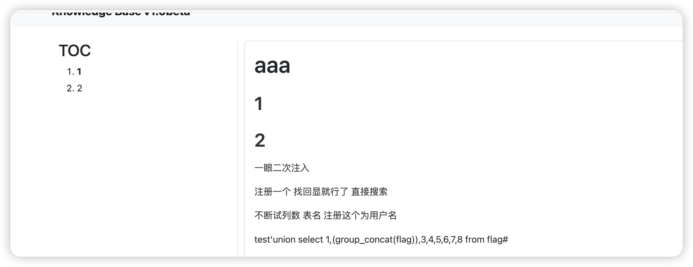
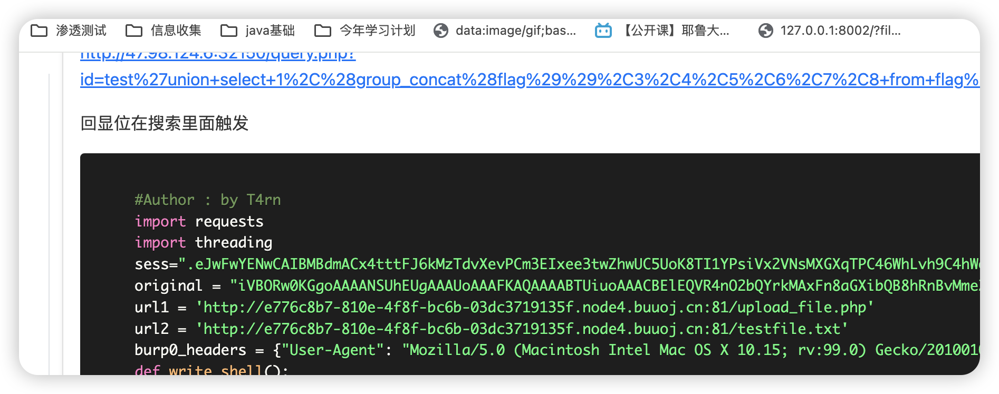

# KnowledgeControl

### 环境搭建

node >=16

mongodb

```docker run -d --name my-mongo -p 27017:27017 mongo```

我只是搭建本地方便作管理 并未设置密码

如果需要设置密码可以在 routes/config.js进行修改


### 功能介绍

含有注册登录页面





含有查找功能



含有上传图片/修改markdown/TOC树



含有代码高亮功能



### Todo List

密码功能没完善

前端一些小bug还没修改
